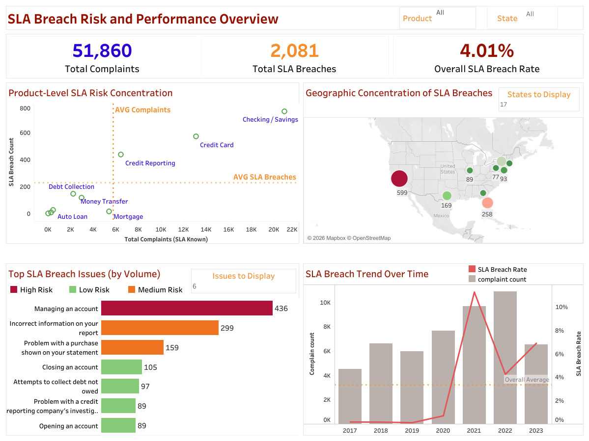

# Service Operations SLA Analysis

## Project Overview
This project analyzes service operations performance using a consumer complaints dataset to identify the main drivers of SLA breaches and prioritize operational improvement areas.

The goal was to help leadership understand where service delays occur, quantify their operational impact, and focus improvement efforts where they would deliver the highest return.

---

## Business Problem

The company is experiencing inconsistent service operations performance, with recurring SLA breaches across products, issue categories, and regions.

Leadership needs to:
- Identify the root causes of SLA failures
- Quantify the operational impact
- Prioritize improvement initiatives based on both complaint volume and breach risk

---

## Tools Used

Excel  
- Initial data inspection  
- Basic data cleaning

MySQL  
- Data validation and cleaning  
- Feature engineering  
- Operational analysis queries

Tableau  
- Interactive dashboard  
- Decision-focused visualization

---

## Project Workflow

1. Data inspection and cleaning in Excel
2. Data transformation and feature engineering in SQL
3. Creation of SLA metrics and eligibility logic
4. Operational analysis across products, issues, geography, and channels
5. Interactive dashboard development in Tableau

---

## Dashboard Overview

The dashboard provides a decision-focused view of SLA performance.

It includes:

- Overall SLA KPIs
- Product-level prioritization analysis
- Root cause analysis by issue category
- Geographic distribution of complaints
- Volume vs risk prioritization view
- Time trends in complaints and SLA performance

Dashboard Screenshot:

---

## Key Insights

1. SLA breaches are concentrated in a small number of high-volume products rather than evenly distributed.

2. A limited set of issue categories drive the majority of SLA failures, indicating systemic process inefficiencies.

3. Geographic analysis shows that breach rates remain relatively consistent across regions, suggesting the problem is systemic rather than location-specific.

4. Submission channel analysis shows minimal variation in breach rates, ruling out intake method as a major driver.

---

## Recommendations

- Prioritize operational improvements in high-volume, high-risk products.
- Standardize resolution workflows for the top issue categories driving SLA breaches.
- Monitor SLA performance over time to ensure improvements keep pace with complaint volume.

---

## Business Impact

This analysis helps leadership focus improvement efforts on the areas that generate the greatest operational impact, enabling more efficient resource allocation and better customer service outcomes.

---

